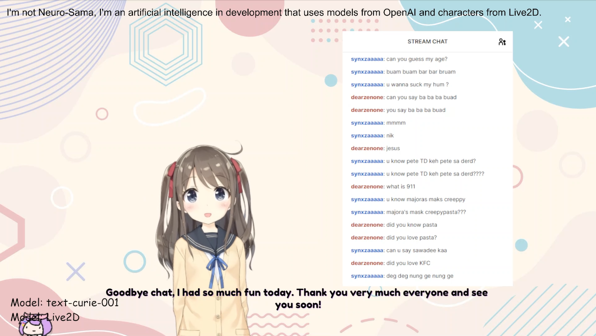

# Elizabeth AI
Elizabeth-AI ist ein KI-basierter Assistent, der die neuesten Technologien von [OpenAI](https://openai.com) für natürliche Sprachverarbeitung und [ElevenLabs](https://elevenlabs.io) für fortschrittliche Text-to-Speech-Funktionen kombiniert. Dieses Projekt wurde als Erweiterung und Verbesserung von [diesem GitHub-Projekt](https://github.com/InsanityLabs/AIVTuber/) (by DevPattarapong & InsanityLabs) entwickelt und baut auf dessen solider Grundlage auf. Elizabeth-AI bietet eine benutzerfreundliche Lösung für interaktive Kommunikation, kreative Ideenfindung und vieles mehr.
    

### Other version of this:
Hier finden Sie zwei weitere Varianten, die auf dem ursprünglichen Projekt basieren. Diese Versionen wurden jeweils angepasst und erweitern die Grundfunktionen durch unterschiedliche Features und Einsatzmöglichkeiten. Jede dieser Versionen bietet eine einzigartige Interpretation des Originalprojekts und kann je nach Anwendungsfall spezifische Vorteile bieten.
 - [InsanityLabs (NovaPlayzGames)](https://github.com/ponlponl123/-Prototype-AIVTuber/tree/NovaPlayzGames)
 - [Originals (Ponlponl123)](https://github.com/ponlponl123/-Prototype-AIVTuber/tree/originals)
    

### Usage
* **Character Model by Live2D**
[Live2D Free Material License](https://www.live2d.jp/en/terms/live2d-free-material-license-agreement/)
* **AI Language Model by OpenAI**
[OpenAI Node License](https://github.com/openai/openai-node/blob/master/LICENSE)

    

### Accounts
Um Elizabeth-AI vollständig nutzen zu können, benötigen Sie Accounts bei den folgenden Plattformen: [OpenAI](https://openai.com/) für die Sprachverarbeitung, [ElevenLabs](https://elevenlabs.io/) für die Text-to-Speech-Funktionen und [Twitch](https://www.twitch.tv/) für die Integration von Streaming-Diensten. Bitte registrieren Sie sich auf diesen Seiten, um die erforderlichen API-Schlüssel zu erhalten und die Funktionen der Anwendung nutzen zu können.

    

### Installation
Um Elizabeth-AI zu installieren und zu konfigurieren, folgen Sie bitte den detaillierten Anweisungen in der Datei [Install.md](./Install.md). Beachten Sie, dass für eine erfolgreiche Installation [Node.js](https://nodejs.org/) in der Version 12.0.0 oder höher sowie [npm](https://www.npmjs.com/) in der Version 6.0.0 oder höher erforderlich sind.  
[Install Document](https://github.com/InsanityLabs/AIVTuber/blob/main/INSTALL.md)

    

### VTube Studio API
Ich verwende das [VTS Desktop Audio Plugin by Lua Lucky](https://lualucky.itch.io/vts-desktop-audio-plugin), um den Ton zu erfassen und ihn als Parameter zu senden, damit sich die Seiten des Charakters bewegen können."  

Plugins list unter:  
[VTubeStudio (Github)](https://github.com/DenchiSoft/VTubeStudio)

[VTS Desktop Audio Plugin](https://lualucky.itch.io/vts-desktop-audio-plugin)

    

## Starten
Wenn schließlich alles wie erwartet verläuft, sollten Sie nun in der Lage sein, `node main.js` erfolgreich auszuführen.