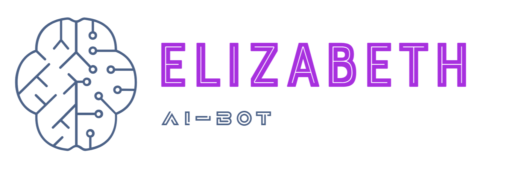
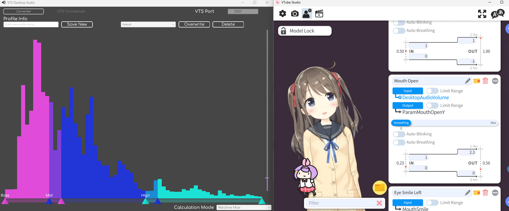

# Elizabeth AI
Elizabeth-AI ist ein KI-basierter Assistent, der die neuesten Technologien von [OpenAI](https://openai.com) für natürliche Sprachverarbeitung und [ElevenLabs](https://elevenlabs.io) für fortschrittliche Text-to-Speech-Funktionen kombiniert. Dieses Projekt wurde als Erweiterung und Verbesserung von [diesem GitHub-Projekt](https://github.com/InsanityLabs/AIVTuber/) (by DevPattarapong & InsanityLabs) entwickelt und baut auf dessen solider Grundlage auf. Elizabeth-AI bietet eine benutzerfreundliche Lösung für interaktive Kommunikation, kreative Ideenfindung und vieles mehr.
    

### Other version of this:
Hier finden Sie zwei weitere Varianten, die auf dem ursprünglichen Projekt basieren. Diese Versionen wurden jeweils angepasst und erweitern die Grundfunktionen durch unterschiedliche Features und Einsatzmöglichkeiten. Jede dieser Versionen bietet eine einzigartige Interpretation des Originalprojekts und kann je nach Anwendungsfall spezifische Vorteile bieten.
 - [InsanityLabs (NovaPlayzGames)](https://github.com/ponlponl123/-Prototype-AIVTuber/tree/NovaPlayzGames)
 - [Originals (Ponlponl123)](https://github.com/ponlponl123/-Prototype-AIVTuber/tree/originals)
    

### Usage
* **Character Model by Live2D**
[Live2D Free Material License](https://www.live2d.jp/en/terms/live2d-free-material-license-agreement/)
* **AI Language Model by OpenAI**
[OpenAI Node License](https://github.com/openai/openai-node/blob/master/LICENSE)

    

### Accounts
Um Elizabeth-AI vollständig nutzen zu können, benötigen Sie Accounts bei den folgenden Plattformen: [OpenAI](https://openai.com/) für die Sprachverarbeitung, [ElevenLabs](https://elevenlabs.io/) für die Text-to-Speech-Funktionen und [Twitch](https://www.twitch.tv/) für die Integration von Streaming-Diensten. Bitte registrieren Sie sich auf diesen Seiten, um die erforderlichen API-Schlüssel zu erhalten und die Funktionen der Anwendung nutzen zu können.

ElevenLabs ist ein Unternehmen, das sich auf fortschrittliche Text-to-Speech-Technologie spezialisiert hat und es Entwicklern ermöglicht, realistische und anpassbare Sprachausgaben zu erzeugen, die in verschiedenen Anwendungen wie Spielen, virtuellen Assistenten und Medieninhalten verwendet werden können.

OpenAI ist ein führendes Forschungsunternehmen im Bereich der künstlichen Intelligenz, das innovative Modelle wie GPT (Generative Pre-trained Transformer) entwickelt, um menschenähnliche Textgenerierung, Sprachverarbeitung und andere KI-Anwendungen zu ermöglichen, die das Potenzial haben, verschiedene Branchen zu transformieren.

Twitch ist eine beliebte Live-Streaming-Plattform, die hauptsächlich für Videospiele, Esport-Wettkämpfe und kreative Inhalte genutzt wird und es Benutzern ermöglicht, in Echtzeit zu interagieren, Inhalte zu konsumieren und Communities zu bilden.

    

### Installation
Um Elizabeth-AI zu installieren und zu konfigurieren, folgen Sie bitte den detaillierten Anweisungen in der Datei [Install.md](./Install.md). Beachten Sie, dass für eine erfolgreiche Installation [Node.js](https://nodejs.org/) in der Version 12.0.0 oder höher sowie [npm](https://www.npmjs.com/) in der Version 6.0.0 oder höher erforderlich sind.  
[Install Document](https://github.com/InsanityLabs/AIVTuber/blob/main/INSTALL.md)

Node.js verwendet ein ereignisgesteuertes, nicht blockierendes I/O-Modell, das es ermöglicht, eine hohe Anzahl gleichzeitiger Verbindungen effizient zu verarbeiten. Dies ist besonders vorteilhaft für Anwendungen, die viele Netzwerkoperationen oder I/O-intensive Aufgaben erfordern, wie z.B. Webanwendungen oder APIs.

NPM ermöglicht Entwicklern, JavaScript-Pakete einfach zu installieren, zu aktualisieren und zu verwalten. Ein Paket kann alles von einer einfachen Funktion bis hin zu umfangreichen Bibliotheken und Frameworks sein. Über NPM können Entwickler auf eine riesige Sammlung von Open-Source-Paketen zugreifen, die von der Community entwickelt wurden.
    

### VTube Studio API
VTube Studio ist eine benutzerfreundliche Software, die es Content-Erstellern ermöglicht, ihre virtuellen Charaktere in Echtzeit zu steuern und zu animieren, indem sie Gesichtserkennungstechnologie und Bewegungsverfolgung nutzt, um eine interaktive und immersive Streaming-Erfahrung zu schaffen. 

Ich verwende das [VTS Desktop Audio Plugin by Lua Lucky (Windows Only)](https://lualucky.itch.io/vts-desktop-audio-plugin), um den Ton zu erfassen und ihn als Parameter zu senden, damit sich die Seiten des Charakters bewegen können."  

Vtube Studio mit Plugins 
[VTubeStudio (Github)](https://github.com/DenchiSoft/VTubeStudio)

    

## Starten
Wenn schließlich alles wie erwartet verläuft, sollten Sie nun in der Lage sein, `node main.js` erfolgreich auszuführen.